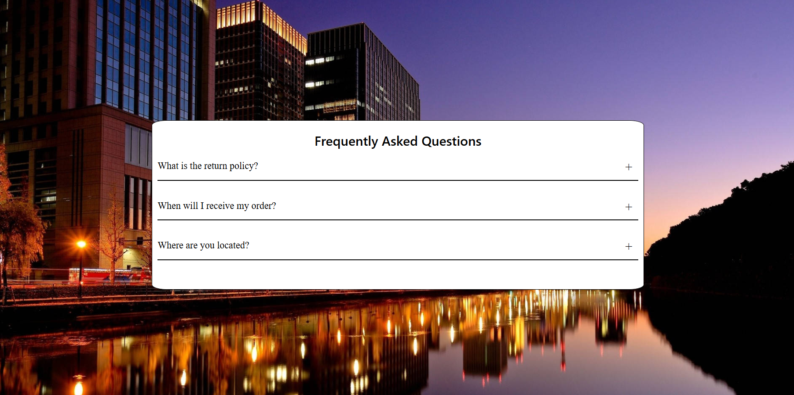

# FAQ

This project creates a Frequently Asked Questions (FAQ) page with expandable and collapsible answers using HTML, CSS, and JavaScript.

## Features
- Expandable and Collapsible Answers
-  Interactive UI Elements
- Responsive design for every screen
- Container Styling
- Smooth Transition Effects

## Table of Contents

- [Demo](#demo)
- [Links](#links)
- [Built with](#built-with)
- [What I learned](#what-i-learned)
- [Author](#author)

## Demo

## Links
- URL : [Live Project](https://abhi1226l.github.io/FAQ/)

## Built with

- Semantic HTML5 markup
- CSS custom properties
- Transition
- DOM
- ClassList Method that is toggle
- For-loop

## What I learned

I learned how to use CSS properties such as `transition` and `animation`, and how to connect these animations with JavaScript to trigger them when a button is clicked.

 ## Author

- Name - Abhishek
